# Smart Farm Management System (SFMS)

> An AI-powered, offline-first mobile application that helps farmers manage farms, crops, finances, and plant health from one place.


## About

Many farmers still depend on paper records and memory to track planting, expenses, harvests, and sales. This makes it difficult to understand a farm's performance, spot overdue work, or react quickly to crop diseases.

SFMS brings those everyday operations into a single mobile experience. Farmers can keep structured records, review financial performance, use AI-assisted plant diagnosis, and make more informed decisions throughout a crop's lifecycle.

## What it helps farmers do

- Manage multiple farms, plots, crops, and planting records.
- Record expenses, harvests, and sales to understand profit and loss.
- Track irrigation, fertilizer applications, equipment, workers, and tasks.
- Maintain seed, fertilizer, pesticide, and equipment inventory.
- Diagnose plant diseases from photos with the AI Plant Doctor.
- Ask farming questions in Somali or English through the AI Farm Assistant.
- Follow a crop's journey from planting through harvest and sale.
- Work offline and synchronize saved work when connectivity returns.

## Key features

| Area | Highlights |
| --- | --- |
| Farm management | Multiple farms, plots, greenhouses, open fields, crop records, and growth tracking. |
| Financial management | Expenses, harvest income, sales, revenue analysis, and profit/loss reporting. |
| Farm operations | Irrigation logs, fertilizer applications, equipment use, workers, daily tasks, and activity history. |
| Inventory | Seeds, fertilizers, pesticides, equipment, low-stock alerts, and expiry awareness. |
| AI Plant Doctor | Photo-based disease analysis, confidence and severity, treatment guidance, safety notes, and prevention tips. |
| AI Farm Assistant | Practical farming guidance in Somali and English. |
| Insights and reports | Farm, crop, expense, harvest, sales, inventory, and financial reporting. |
| Community | Farmer discussions, knowledge sharing, and peer support. |

## AI crop journey

The crop journey provides a chronological story for each crop, connecting planting, irrigation, fertilizer applications, disease observations, AI diagnoses, treatments, expenses, harvests, sales, and profit summary in one timeline.

## Screenshots

| Sign In (Somali) | Create Account | Reset Password |
|---|---|---|
| 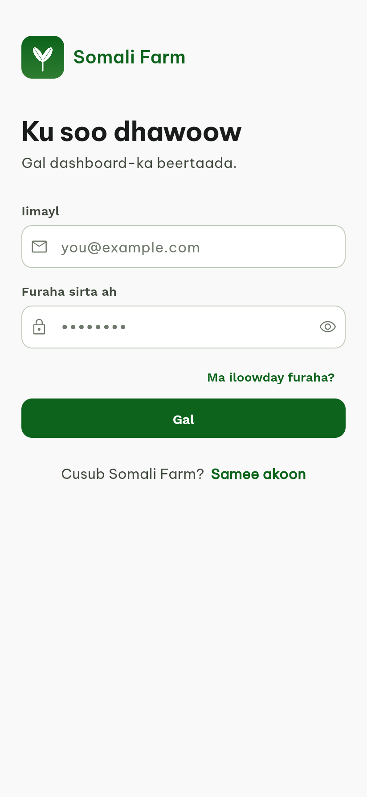 | 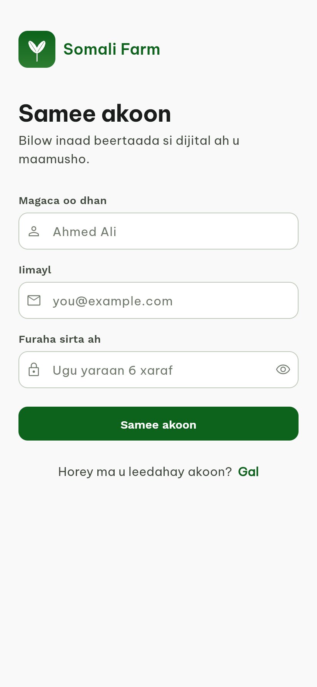 |  |

| Dashboard | My Farms | Reports |
|---|---|---|
| 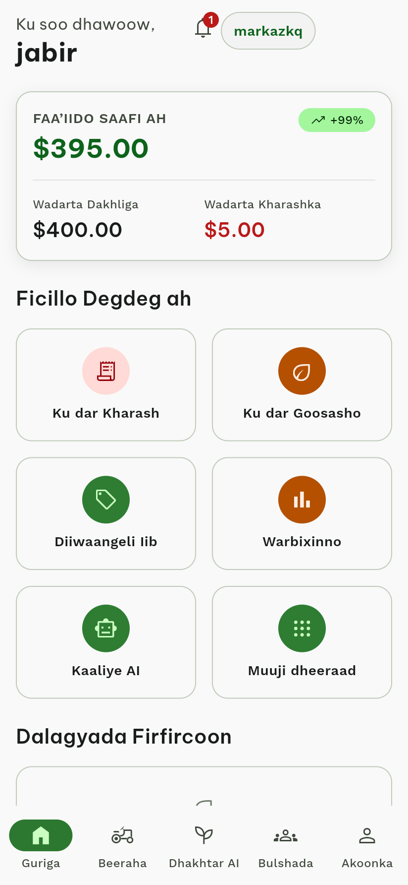 | 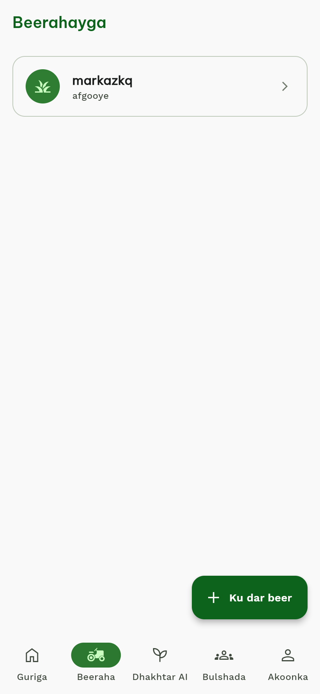 | 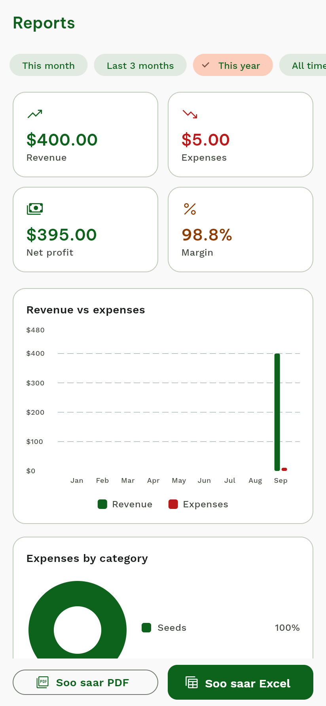 |

| AI Plant Doctor | AI Assistant | Community |
|---|---|---|
| 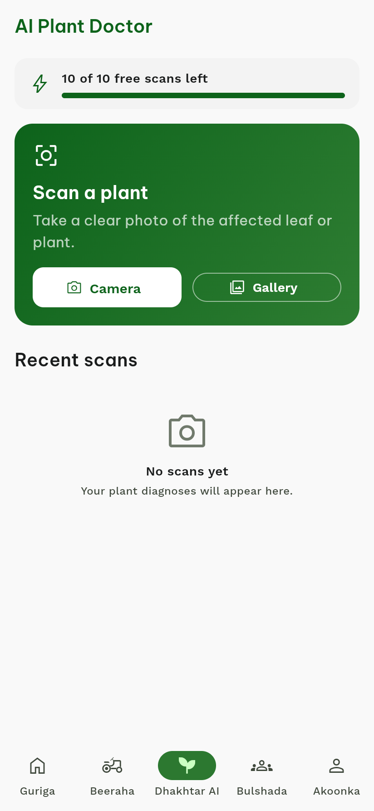 | 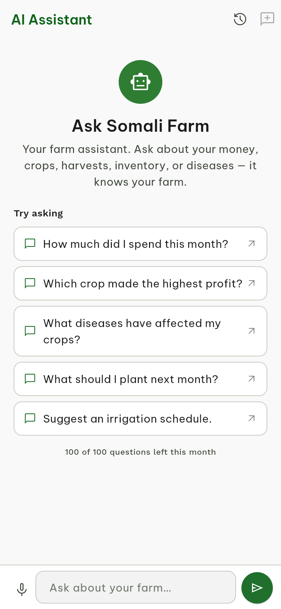 | 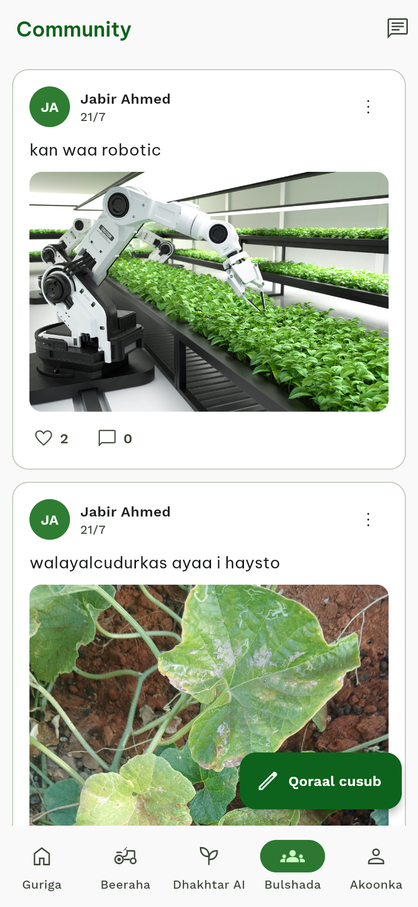 |

| Records | Add Expense | Notifications |
|---|---|---|
| 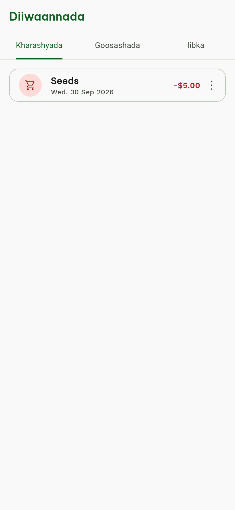 | 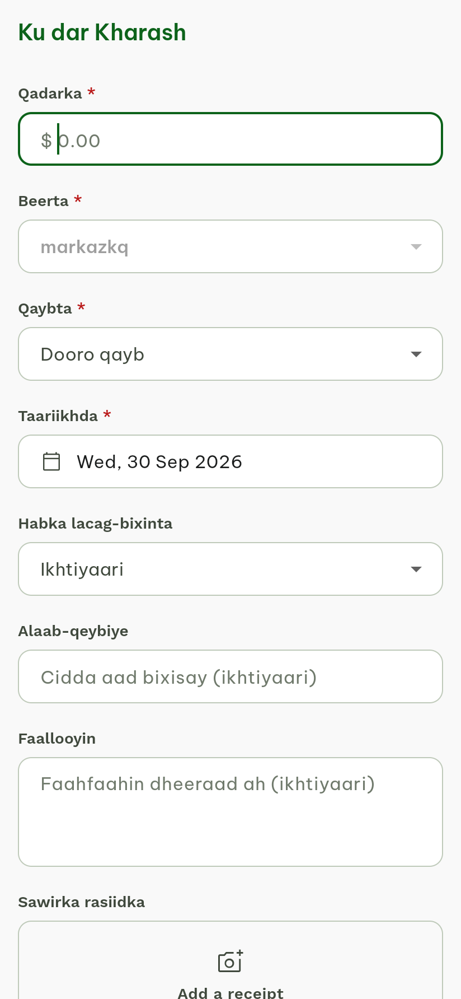 |  |

| Account | Plans & Upgrade |
|---|---|
| 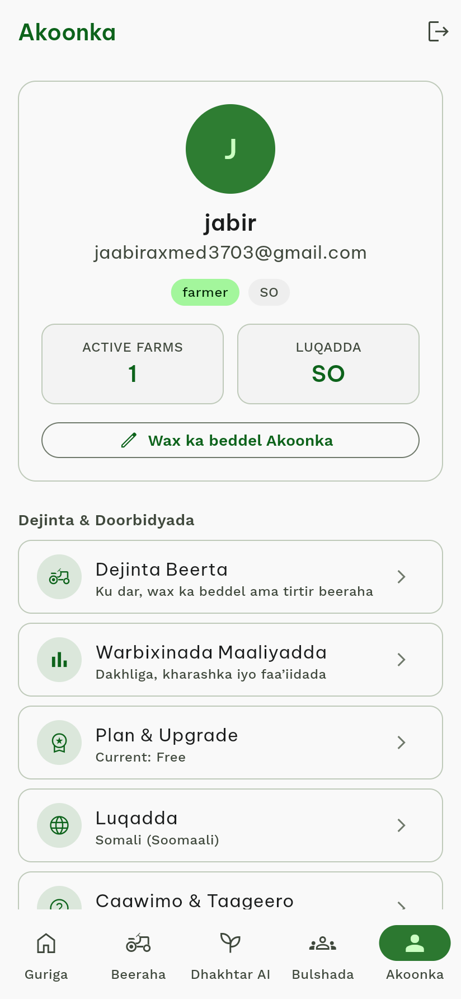 | 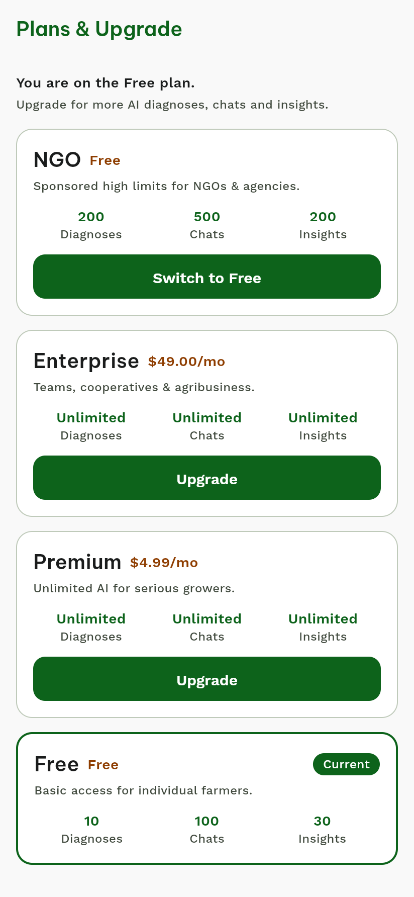 |

## Architecture

```text
Flutter mobile app
        |
        v
Supabase Auth + PostgreSQL + Storage
        |
        v
Supabase Edge Functions
        |
        v
Google Gemini AI
```

## Technology stack

- **Mobile:** Flutter and Dart
- **State management:** Riverpod
- **Backend:** Supabase
- **Database and authentication:** PostgreSQL and Supabase Auth
- **Storage:** Supabase Storage
- **AI:** Google Gemini, accessed through a Supabase Edge Function
- **Offline support:** Local storage and synchronization outbox

## Getting started

### Prerequisites

- Flutter SDK 3.x (stable channel)
- An Android emulator or physical device
- A Supabase project if you want to use your own backend

### Install and run

```bash
git clone https://github.com/Jabir-Ahmed-Isse/smart_farm_management_system.git
cd smart_farm_management_system
flutter pub get
flutter run
```

### Configure a different Supabase project

Pass your own public Supabase values at build time:

```bash
flutter run \
  --dart-define=SUPABASE_URL=https://YOUR-REF.supabase.co \
  --dart-define=SUPABASE_ANON_KEY=YOUR_PUBLISHABLE_KEY
```

The Gemini API key is kept on the server as a Supabase Edge Function secret; it should never be added to the Flutter app or committed to Git.

## Security

- Supabase authentication and role-based access controls.
- Row Level Security (RLS) policies in the database.
- Server-side handling of the Gemini API key.
- `.env` files are excluded from version control.

## Roadmap

- [ ] Market price intelligence
- [ ] AI yield prediction
- [ ] IoT sensor integration
- [ ] Drone and satellite monitoring
- [ ] Farm marketplace and expert consultation

## Author

**Jabir Ahmed Isse**
Software Engineer · Flutter Developer · Full Stack Developer · AI Product Engineer

## License

No license file has been added yet. Add a `LICENSE` file before distributing or reusing this project under a specific license.

---

If this project is useful to you, consider giving it a star on GitHub.
